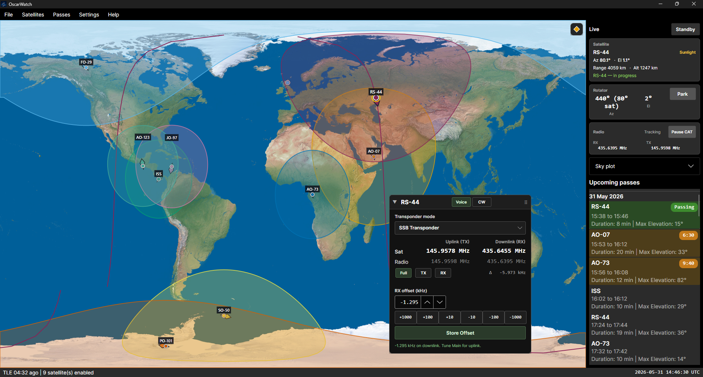

# OscarWatch

**OscarWatch is still in development**



Desktop satellite tracking for amateur radio operators. OscarWatch shows where AMSAT spacecraft are, predicts passes over your station, works out Doppler-corrected uplink and downlink frequencies, and can drive your rotator and radio during a pass, all from one map-centred window.

TLEs and the transponder frequency database are published from [tle.oscarwatch.org](https://tle.oscarwatch.org/) ([TLEs](https://tle.oscarwatch.org/), [transponder database](https://tle.oscarwatch.org/satellite_database.json)).

## Who is this for?

Licensed amateurs working **VHF/UHF satellites**: FM cubesats (SO-50, ISS, …), linear transponders (RS-44, FO-29, …), and similar modes. You should already be comfortable with pass times, azimuth, elevation, and Doppler; OscarWatch handles the maths and optional hardware control so you can focus on the contact.

You do **not** need to be a programmer to use published builds.

## What OscarWatch does

- **Map and sky plot**: subpoint, ground track, footprint, and a polar view from your QTH; optional **DX station** marker and live Az/El at a remote grid for the focused satellite; status-bar **map time** buttons (−15m / −5m / Now / +5m / +15m) to preview footprints (rotator and CAT stay on live time)
- **Pass list**: upcoming passes with max elevation and time-to-AOS; right-click a row for a polar **pass plot** at your QTH; sidebar scrolls on smaller windows
- **Frequency panel**: transponder modes from a built-in database, live uplink/downlink with Doppler, RX offsets (separate for Voice and CW on linear SSB), and CTCSS (access/arm tones). Keyboard shortcuts: [help/keyboard-shortcuts.html](help/keyboard-shortcuts.html) (**Ctrl+W**, numpad **+** / **−** for RX offset, **S** for solo map view, map arrows, etc.)
- **Optional automation**: serial **rotator** tracking and **radio CAT** (Doppler, satellite/split layout, tones) during a pass
- **Optional extras**: voice “satellite rising” alerts, pass **WAV recording**, **Cloudlog** frequency sync, **GPS** (NMEA serial) for station position and optional UTC for tracking

OscarWatch does **not** decode telemetry or replace your logging software; it is a pass-tracking and station-assist tool for the shack or field.

## Getting started

### Download

Pre-built packages for Windows, macOS, and Linux are on the **[Releases](https://github.com/magicbug/OscarWatch-Tracker/releases)** page (see [Cross-platform publish](#cross-platform-publish) for platform names). Extract the archive for your OS and run `OscarWatch`.

**macOS (first install):** release builds are not code-signed or notarized. macOS may block the app or bundled native libraries on first use:

1. **OscarWatch**: if Finder says the app “cannot be opened”, right-click `OscarWatch` → **Open** once, or use **System Settings → Privacy & Security → Open Anyway**.
2. **Pass recording**: if you use automatic WAV capture, macOS may also ask you to allow `**libportaudio.dylib`** (in `runtimes/osx-*/native/` inside the app folder). Approve it the same way when prompted.
3. **Microphone**: allow microphone access when you first enable recording in Settings.

These prompts are usually one-time per install. Tracking, passes, and radio/rotator control work without pass recording if you skip step 2.

To build from source instead, see [Build and run](#build-and-run) below.

### First-time setup

1. Open **Settings → Station** and enter your latitude, longitude, and grid square.
2. **Satellites → Select satellites**: enable the spacecraft you plan to work.
3. **Satellites → Refresh TLEs**: refresh at least once per operating day (or enable auto-update under **Settings → Tracking**).
4. If you use a rig or rotator: **Settings → Radio** and **Settings → Rotator**: set COM ports (each device — rig, rotator, GPS — needs its **own** port).
5. If you rove with a USB GPS: **Settings → Integrations → GPS** — enable, pick COM port and baud (often 4800 or 9600), use **Refresh status** / **Apply fix to station** or turn on auto-update.
6. Click a satellite on the map or in the pass list to **focus** it. Live az/el and frequencies apply to the focused pass.

### During a pass

1. Confirm the correct **transponder mode** in the frequency panel on the map (e.g. FM voice, Mode B USB/LSB). On linear SSB modes, use **Voice** / **CW** in the panel title bar (or **Ctrl+W**). See [frequencies help](help/frequencies.html).
2. Watch **azimuth** and **elevation** in the sidebar. Point your antenna there (or let the rotator track if enabled).
3. Set your radio from the **Radio** / **Sat** columns in the overlay, or enable CAT so OscarWatch updates frequencies for Doppler.
4. On FM satellites, pick the correct **CTCSS** tone when access and arm are both listed.

### Standby (browsing only)

Press **Standby** in the sidebar when you are only planning or browsing: the rotator parks, CAT pauses, and accidental tracking stops. Press **Resume** before a real pass. While in Standby, menu **Rotator** opens manual az/el control for a quick contact between passes.

### Operator guide

Plain-language help ships with the app: **Help → Operator guide** (also in the `[help/](help/)` folder). The guide is **English only**; the app UI can be switched under **Settings → Appearance → Language** (restart required). Topics include quick start, frequencies, TLEs, pass planning, radio/rotator setup, recording, and troubleshooting.

---

## Features

- **World map**: equirectangular Earth texture with satellite subpoint, ground track, footprint overlays (optional motion arrows), your QTH, and an optional remote **DX station** grid marker; **map time** scrubbing from the status bar (hardware tracking stays live)
- **Sky plot**: polar view of satellite azimuth/elevation relative to your station; click to focus; expand/collapse state is remembered
- **TLE catalog**: fetched from `https://tle.oscarwatch.org/`, cached under `%AppData%/OscarWatch/`
- **TLE auto-update**: manual refresh, on startup (if stale), or every 6 hours while running (Settings → Tracking)
- **Satellite picker**: choose which spacecraft to track
- **Pass predictions**: upcoming passes with TCA (time of closest approach / max elevation), min-elevation and min-duration filters; sidebar **View pass plot** for a single-station polar chart
- **Pass planner**: multi-station profiles (home / portable), pass quality filters, and `.ics` calendar export for contest or field-day planning
- **Mutual pass finder**: find passes visible from two stations at once (Passes → Mutual pass finder)
- **DX station monitor**: enter a remote Maidenhead grid on the map; see where that station is and live azimuth/elevation for the focused satellite from their QTH (compact draggable overlay)
- **Live telemetry**: azimuth, elevation, range, and altitude updated every second (UTC)
- **Voice announcements**: optional spoken “rising” alerts when a satellite crosses a configurable elevation while ascending (e.g. “Alpha Oscar Zero Seven is rising”); Settings → Voice
- **Pass recording**: optional automatic WAV capture from a line-in or USB audio device while the **focused** satellite is above configurable elevation thresholds; Settings → Recording. Files save to `%AppData%/OscarWatch/recordings/` by default as `{sat-name}-{yy}-{MM}-{dd}-{HH}-{mm}.wav` (UTC). A red **REC** badge appears on the pass row while recording.
- **Doppler frequencies**: draggable overlay on the world map with transponder modes from the satellite database, live radio/sat uplink & downlink, RX offsets (separate stored values for Voice and CW on linear SSB), CTCSS (access/arm), and **Voice/CW** toggle for linear SSB (header buttons + **Ctrl+W**; CAT/Cloudlog follow **Settings → Radio → Linear CW: keep receive in USB/LSB**)
- **Transponder database editor**: Satellites → Manage transponder database… (add satellites from your **TLE catalog** or a custom name, **Import/Export JSON**, edit modes); **Satellites → Update transponder database…** merges published modes from [tle.oscarwatch.org/satellite_database.json](https://tle.oscarwatch.org/satellite_database.json) (new entries added with your consent; local edits kept on conflicts unless you accept remote). See [documents/satellite-database.md](documents/satellite-database.md)
- **Radio CAT**: doppler tracking, satellite/split setup, Main/Sub VFOs, uplink CTCSS where supported; Settings → Radio (see [Supported hardware](#supported-hardware))
- **Rotator control**: serial pass tracking, manual park, and **manual rotator** (az/el dialog in Standby for quick contacts between passes); Settings → Rotator (see [Supported hardware](#supported-hardware))
- **Cloudlog**: optional Radio API v2 uplink/downlink when tracking (Settings → Cloudlog)
- **Appearance**: light, dark, or system theme (sky plot adapts; world map image stays light); 12- or 24-hour clock; optional greyline and footprint motion arrows on the map

## Supported hardware

OscarWatch talks to rigs and rotators over **serial CAT** (COM port on Windows, device path on Linux/macOS). Rig and rotator must use **different** ports.

### Radios


| Radio               | Protocol          | Notes                                                                                                      |
| ------------------- | ----------------- | ---------------------------------------------------------------------------------------------------------- |
| **ICOM IC-910**     | CI-V              | Cross-band: satellite mode, Main/Sub, Sub uplink CTCSS. Receive-only (uplink 0): SAT off, downlink on Main |
| **ICOM IC-9100**    | CI-V              | Same as IC-9700; default CI-V address `7C`                                                                 |
| **ICOM IC-9700**    | CI-V              | Same layout as IC-910                                                                                      |
| **ICOM IC-821H**    | CI-V              | Satellite Main/Sub only (no split CAT); same-band duplex (e.g. ISS Packet) stays in SAT; default CI-V `4C`; uplink tone manual on radio |
| **Yaesu FT-847**    | Yaesu CAT         | Satellite mode, SAT RX/TX VFOs, doppler, uplink CTCSS                                                      |
| **Yaesu FT-817 / FT-818** | Yaesu CAT (8N2) | **Dual radio only**: downlink radio on one COM port, uplink on another (e.g. two FT-818s); full doppler; linear passband tuning on the downlink VFO; FM locks the dial via CAT |
| **ICOM IC-705**     | CI-V              | **Dual radio only**: one or two IC-705s, or mixed with FT-817/818; one VFO per radio; per-leg CI-V address (default `A4`) |
| **ICOM IC-706 / IC-706MKII / IC-706MKIIG** | CI-V | **Dual radio only**: shared CI-V driver; default addresses `48` / `4C` / `58`. IC-706 and MKII are 2m-only; MKIIG adds 70cm. 23cm not supported |
| **Yaesu FT-991 / FT-991A** | Yaesu ASCII CAT (8N2) | **Dual radio only**: one or two FT-991(A)s, or mixed with other dual legs; VFO-A per radio; FM dial lock via `LK` |
| **Yaesu FTX-1 Field / FTX-1optima** | Yaesu ASCII CAT (8N2) | **Dual radio only**: same newcat subset as FT-991; use CAT-1 (Enhanced COM) per leg; HF/50/144/430 coverage |
| **Kenwood TS-2000** | Kenwood ASCII CAT | **Beta**: before tracking: put the radio in **SAT** mode and turn **memory mode off** on the front panel; then OscarWatch uses SATL via CAT, auto `FA`/`FB` band swap, linear CW uplink in SATL, TRACE off via CAT |
| **Dummy rig**       | n/a               | No serial I/O; for UI and doppler testing without a radio                                                  |


All tracked rigs: linear NOR/REV doppler, interactive receive-VFO passband tuning on USB/LSB/CW (on single-radio Main/Sub rigs, uplink CAT is deferred briefly after dial moves; on **dual radio** setups, spin the **downlink** radio while uplink doppler continues), TX/RX offset spinners, configurable CAT thresholds and pause.

More rigs: see [TODO.md](TODO.md) and [building radio drivers](documents/building-radio-drivers.md).

### Why not HamLib?

HamLib is a good fit for plenty of general rig control. Satellite passes are not one of them. You are not only setting a frequency on VFO A. You need satellite mode, sensible RX/TX routing, split or VFO exchange, uplink tone when the mode needs it, and doppler with a TX-fixed or RX-fixed plan, often with rig-specific CAT quirks on top.

Trackers that hand satellite work to HamLib have, in my experience, often lacked the right commands, mishandled VFO layout, or let doppler slip during a real pass. OscarWatch uses native drivers per protocol (`IRigDriver`) and shared pass logic in `RigController`. See [building radio drivers](documents/building-radio-drivers.md) for how that is structured.

Pull requests for more native rig support are welcome. A HamLib backend is not on the roadmap.

### Rotators


| Controller       | Protocol    | Notes                                               |
| ---------------- | ----------- | --------------------------------------------------- |
| **Yaesu GS-232** | GS-232      | Yaesu rotators and many GS-232 clones               |
| **EasyComm**     | EasyComm II | SPID, M2, and other EasyComm-compatible controllers |


Pass tracking when elevation is above the track-start threshold; manual **Park** in the sidebar; **manual rotator** in Standby (menu **Rotator…**: set az/el, Rotate, Stop, Park for a quick contact without resuming pass tracking). Azimuth range **360°** or **450°** (e.g. G-5500). On **450°** rotators, optional **smart azimuth** chooses 361–450° commands for the shortest path across north (Settings → Rotator). Optional **calibration offsets** correct pass tracking and manual moves; park uses your configured park az/el exactly.

More controllers: [building rotator drivers](documents/building-rotator-drivers.md).

## Settings

Open **Settings** from the menu. Tabs:


| Tab            | Purpose                                                                                                                                                                                                                                        |
| -------------- | ---------------------------------------------------------------------------------------------------------------------------------------------------------------------------------------------------------------------------------------------- |
| **Station**    | Display name, latitude/longitude, Maidenhead grid square, altitude ASL                                                                                                                                                                         |
| **TLE**        | Catalogue source (OscarWatch, AMSAT.org, custom URL, local file) and automatic update schedule                                                                                                                                                  |
| **Tracking**   | Minimum pass elevation, prediction window, transponder database check on startup                                                                                                                                                               |
| **Appearance** | Light / dark / system theme; 12- or 24-hour clock; footprint motion arrows and optional greyline on/off                                                                                                                                       |
| **Voice**      | Enable announcements, trigger elevation (default −3°), voice selection, test button                                                                                                                                                            |
| **Recording**  | Automatic pass WAV capture, input device, start/stop elevation, output folder, test clip                                                                                                                                                       |
| **Rotator**    | Type (GS-232 / EasyComm), COM port, 360°/450° azimuth, smart 450°, park, track-start elevation, calibration offsets                                                                                                                            |
| **Radio**      | Rig type, COM port, **Dual radio** (FT-817/818, FT-991(A), IC-705, IC-706 series, or mixed; separate downlink/uplink COM ports), region, per-leg CI-V address for ICOM dual legs, linear CW receive mode (USB/LSB vs CW on both VFOs), Doppler CAT thresholds (FM default 350 Hz, SSB/CW default 50 Hz; see [help](help/radio-rotator.html#doppler-cat-thresholds)), pause CAT |
| **Integrations** | **GPS** (NMEA serial: COM port, auto-update station, optional GPS UTC for tracking — see [help](help/settings.html#gps)); **hams.at** roves; **Cloudlog** (URL, API key, logbook, radio API)                                              |


Settings are stored in `%AppData%/OscarWatch/settings.json`.

### GPS (serial or gpsd)

Configure under **Settings → Integrations → GPS**. Choose **Serial (COM port)** or **gpsd (network)**:

- **Serial** — reads standard **$GPGGA** / **$GNGGA** and **$GPRMC** / **$GNRMC** on a dedicated COM port (8N1; baud usually **4800** or **9600**)
- **gpsd** — connects to a running [gpsd](https://gpsd.io/) daemon over TCP (default port **2947**); useful when a Pi or Linux host already shares the GPS on your LAN

- **Automatically update station position** — writes lat/lon (and grid square) from a valid fix; optional altitude from GGA
- **Use GPS UTC for satellite tracking** — orbit propagation uses GPS time instead of the PC clock (does **not** change the Windows system clock)
- **Apply fix to station** — one-shot update of **Settings → Station** fields
- Status bar shows **GPS** (green = fix, red = no fix) and **GPS Time** (when time sync is enabled) — see [help](help/map-and-sidebar.html#status-bar)

Serial GPS must use a **different** COM port from the radio and rotator. Network gpsd does not use a COM port.

Planned work is listed in [TODO.md](TODO.md). Transponder database merge/sync is documented in [documents/satellite-database.md](documents/satellite-database.md).

### Voice announcements (platform notes)


| Platform    | Text-to-speech                                          |
| ----------- | ------------------------------------------------------- |
| **Windows** | Built-in (`System.Speech`)                              |
| **macOS**   | Built-in (`/usr/bin/say`)                               |
| **Linux**   | Requires `espeak-ng` (preferred) or `spd-say` on `PATH` |


If TTS is unavailable, the Voice tab shows a notice and announcements are skipped.

### Pass recording (platform notes)

Audio capture uses [PortAudio](https://www.portaudio.com/) (via PortAudioSharp2). Native runtimes are included in published builds for Windows x64, macOS (Intel/Apple Silicon), and Linux x64/ARM64.


| Platform    | Notes                                                                                                                                    |
| ----------- | ---------------------------------------------------------------------------------------------------------------------------------------- |
| **Windows** | Select your radio interface or sound card input in Settings → Recording                                                                  |
| **macOS**   | Core Audio devices; see [macOS (first install)](#download) if `libportaudio.dylib` is blocked; grant microphone permission when prompted |
| **Linux**   | Requires PulseAudio or ALSA; install `libasound2` / PulseAudio as needed for your distro                                                 |


WAV files are uncompressed (~5 MB/min mono at 44.1 kHz). Use an external tool if you need MP3 later.

## Settings location


| File                    | Path                                                                                             |
| ----------------------- | ------------------------------------------------------------------------------------------------ |
| Settings                | `%AppData%/OscarWatch/settings.json`                                                             |
| Recordings              | `%AppData%/OscarWatch/recordings/`                                                               |
| TLE cache               | `%AppData%/OscarWatch/tle-cache.txt`                                                             |
| Transponder DB (user)   | `%AppData%/OscarWatch/satellite_database.json`                                                   |
| Transponder DB (remote) | [tle.oscarwatch.org/satellite_database.json](https://tle.oscarwatch.org/satellite_database.json) |
| Logs                    | `%AppData%/OscarWatch/logs/` (daily rolling `oscarwatch-YYYYMMDD.log`, 14 days retained)         |


Open the recordings or log folder from **Help → Open recordings folder** or **Help → Open logs folder**. Unhandled crashes and rig/rotator/CAT errors are written to logs (not API keys).

## Contributing

Pull requests are welcome for bug fixes, rig or rotator drivers, tracking behaviour, operator-facing features, **UI translations**, and **transponder database** entries (new satellites/modes or corrections with a credible source). For larger changes, open an issue first so we can agree direction before you spend time on a big diff.

Transponder data is also published at [tle.oscarwatch.org/satellite_database.json](https://tle.oscarwatch.org/satellite_database.json); see [documents/satellite-database.md](documents/satellite-database.md).

### Translations (UI)

OscarWatch strings live in `.resx` files under `OscarWatch/Resources/`. **British English** (`Strings.resx`, locale `en-GB`) is the source — add or change keys there first, then update the other locale files.

| Language | Locale | Resource file |
| -------- | ------ | ------------- |
| English (UK) | `en-GB` | `Strings.resx` |
| Japanese | `ja` | `Strings.ja.resx` |
| Portuguese (Brazil) | `pt-BR` | `Strings.pt-BR.resx` |
| Chinese (Simplified) | `zh-CN` | `Strings.zh-CN.resx` |

**Using another language:** **Settings → Appearance → Language**, then restart the app.

**Improving an existing translation:** edit the matching `Strings.*.resx` file. Keep the `name="..."` keys identical to `Strings.resx`; only change the `<value>` text. Open a pull request with your changes — even a few corrected menu labels helps.

**Adding a new language:** please [open an issue](https://github.com/magicbug/OscarWatch-Tracker/issues) first (locale code, font/script needs, and whether you can maintain it across releases). In code you will typically need:

1. `OscarWatch/Resources/Strings.<locale>.resx` — copy `Strings.resx` and translate every `<value>` (600+ strings today).
2. `OscarWatch/Localization/LocalizationCulture.cs` — register the locale.
3. `OscarWatch/ViewModels/SettingsViewModel.cs` — add a `LanguageOption` so it appears in Settings.
4. `Settings.Language.*` entries in **all** `.resx` files for the language name shown in the picker.

The bundled **operator help** (`help/`) is not localized yet; translation PRs cover the desktop UI only. A few labels (rig and rotator type names in Settings) are still hard-coded in English.

After editing `.resx` files, run `dotnet build OscarWatch/OscarWatch.csproj` and spot-check the UI in your locale.

## Support

OscarWatch is **free** and open source. If you find it useful, you can support ongoing development via [GitHub Sponsors](https://github.com/sponsors/magicbug) or [PayPal](https://www.paypal.com/paypalme/PGoodhall). If you donate, please let Peter know your **callsign** so you can be thanked.

---

## For developers

### Requirements

- [.NET 10 SDK](https://dotnet.microsoft.com/download)

### Build and run

```bash
dotnet build OscarWatch.slnx
dotnet run --project OscarWatch/OscarWatch.csproj
```

For lower memory use, prefer **Release** (`-c Release`). Debug builds include Avalonia diagnostics overhead.

```bash
dotnet run -c Release --project OscarWatch/OscarWatch.csproj
```

### Cross-platform publish

#### GitHub Actions

**[Publish](.github/workflows/publish.yml)** runs on a version tag (`v`*) or a manual workflow dispatch. It builds and tests on Linux, then publishes installable packages per platform.

**Artifacts:**


| Artifact                 | Runtime                              |
| ------------------------ | ------------------------------------ |
| `OscarWatch-win-x64`     | Windows x64                          |
| `OscarWatch-osx-arm64`   | macOS Apple Silicon                  |
| `OscarWatch-osx-x64`     | macOS Intel                          |
| `OscarWatch-linux-x64`   | Linux x64                            |
| `OscarWatch-linux-arm64` | Linux ARM64 (Raspberry Pi 64-bit OS) |


- **Manual run:** Actions → **Publish** → **Run workflow**
- **Release:** `git tag v1.0.0 && git push origin v1.0.0` → GitHub Release with all archives

### Local publish

```bash
# Windows
dotnet publish OscarWatch/OscarWatch.csproj -c Release -r win-x64 --self-contained

# macOS (Apple Silicon)
dotnet publish OscarWatch/OscarWatch.csproj -c Release -r osx-arm64 --self-contained

# macOS (Intel)
dotnet publish OscarWatch/OscarWatch.csproj -c Release -r osx-x64 --self-contained

# Linux x64
dotnet publish OscarWatch/OscarWatch.csproj -c Release -r linux-x64 --self-contained

# Raspberry Pi (64-bit OS)
dotnet publish OscarWatch/OscarWatch.csproj -c Release -r linux-arm64 --self-contained
```

Publish profiles are under `OscarWatch/Properties/PublishProfiles/` (e.g. `dotnet publish -p:PublishProfile=win-x64`).

### Project structure


| Project            | Role                                                                             |
| ------------------ | -------------------------------------------------------------------------------- |
| `OscarWatch.Core`  | Models, TLE parser, settings, Maidenhead grid, orbit interfaces, voice/phonetics |
| `OscarWatch.Orbit` | OrbitTools adapters, pass predictor, ground geometry                             |
| `OscarWatch`       | Avalonia UI                                                                      |


### Developer documentation

- [documents/](documents/): how to add **radio** and **rotator** drivers (`IRigDriver`, `IRotatorDriver`); [satellite transponder database](documents/satellite-database.md) (remote updates, merge policy, schema)
- [help/](help/): operator HTML help (bundled with the app)
- [docs/ACCESSIBILITY.md](docs/ACCESSIBILITY.md): UI contrast, colour-blind-safe tracking colours, keyboard

### Orbit propagation

Uses [OrbitTools](http://www.zeptomoby.com/satellites/) Public Edition via [Zeptomoby.OrbitTools.Orbit](https://www.nuget.org/packages/Zeptomoby.OrbitTools.Orbit) (non-commercial). For commercial use or the Track Library (pass engine, iso-elevation footprints), obtain a [Professional license](http://www.zeptomoby.com/satellites/editionInfo.htm).

---

## License

Copyright © 2026 **Peter Goodhall (MM9SQL)**.

OscarWatch is free software: you can redistribute it and/or modify it under the terms of the [GNU Affero General Public License v3.0 or later](https://www.gnu.org/licenses/agpl-3.0.html) (AGPL-3.0-or-later). See [LICENSE.md](LICENSE.md) for the full license text.

If you run a modified version as a network service, AGPL requires making the corresponding source available to users who interact with it over the network.

Third-party components (OrbitTools, Avalonia, TLE sources, map imagery, etc.) have their own licences. See [CREDITS.md](CREDITS.md) and the Orbit propagation section above.

## Credits

See [CREDITS.md](CREDITS.md).

## Supporters

Donors who have helped fund development are listed in [supporters.md](supporters.md).