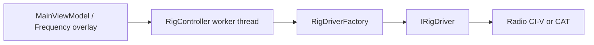

# Building radio (rig) drivers

OscarWatch controls radios for **satellite doppler tracking** via CAT. Each radio protocol implements `IRigDriver`. Doppler policy, VFO layout, and pass setup live in **`RigController`**; the driver is a thin serial/protocol layer.

## Architecture



- **`RigController`** ([`OscarWatch/Rig/RigController.cs`](../OscarWatch/Rig/RigController.cs)) — background thread (~100 ms loop): satellite mode, Main/Sub VFO selection, doppler frequency writes, CTCSS, split, FM companion leg, dial-change detection. Linear USB/LSB/CW uses **interactive** tuning: pause CAT while Main moves, resume after eight stable dial samples (~800 ms), defer Sub uplink writes for 2.5 s after dial activity, and `RestoreOperatorVfo()` to keep receive VFO selected on ICOM-style rigs.
- **`IRigDriver`** — open port, read/set frequency, VFO, mode, satellite mode, tones.
- **`RigSettings`** ([`OscarWatch.Core/Models/RigSettings.cs`](../OscarWatch.Core/Models/RigSettings.cs)) — port, baud rate, CI-V address, doppler thresholds, CAT delay.
- **`IcomCivCodec`** ([`OscarWatch.Core/Radio/IcomCivCodec.cs`](../OscarWatch.Core/Radio/IcomCivCodec.cs)) — encode/decode CI-V frames (Core, no serial I/O).

## `IRigDriver` contract

```csharp
public interface IRigDriver : IDisposable
{
    bool IsConnected { get; }
    RigType RigType { get; }
    void Open();
    long? ReadFrequencyHz(RigVfo vfo);
    bool SetFrequencyHz(long hz);
    void SelectVfo(RigVfo vfo, bool force = false);
    void SetMode(string mode);
    void SetSplitOn(bool on);
    void SetSatelliteMode(bool on);
    void ExchangeVfos();
    void SetToneOn(bool on);
    void SetToneSquelchOn(bool on);
    void SetToneHz(double hz, bool squelchTone);
    bool SupportsTracking { get; }
    bool SupportsVfoExchange => true;
}
```

| Member | Expectations |
|--------|----------------|
| `SupportsTracking` | If `false`, `RigController` will not run doppler updates (use for rigs that only support a subset of features). |
| `Open` | Open serial (or other) link. On failure, leave `IsConnected` false. |
| `ReadFrequencyHz` | Select VFO if needed, return Hz or null. May cache last good value when offline (see Icom base). |
| `SetFrequencyHz` | Set frequency on **currently selected** VFO. Return `true` if accepted. Validate satellite band in driver or rely on codec. |
| `SelectVfo` | `RigVfo`: `VfoA`, `VfoB`, `Main`, `Sub` — Icom satellite stack uses Main/Sub. |
| `SetSatelliteMode` | Rig-specific satellite/SAT menu (required for tracking). |
| `SetMode` | `"FM"`, `"USB"`, etc. — Icom uses CI-V mode bytes. |
| `SetSplitOn` / `ExchangeVfos` | Satellite split operation. |
| Tone methods | Sub uplink CTCSS for FM satellites. |

`RigController` passes **`RigTrackingContext`** (from the frequency overlay) with uplink/downlink offsets and database mode; the driver does not compute doppler. Use **`EffectiveUplinkMode`** / **`EffectiveDownlinkMode`** for `SetMode` — they apply the panel **Voice/CW** choice and **`RigSettings.CwKeepSidebandDownlink`** via **`TransponderOperatingModes`** in Core (drivers should not reimplement that logic).

## ICOM CI-V stack (recommended pattern)

Most satellite logic is shared in **`IcomCivDriverBase`** ([`OscarWatch/Rig/IcomCivDriverBase.cs`](../OscarWatch/Rig/IcomCivDriverBase.cs)):

- Owns **`IcomSerialTransport`** ([`OscarWatch/Rig/IcomSerialTransport.cs`](../OscarWatch/Rig/IcomSerialTransport.cs)) — framing, retries, read timeout
- Implements frequency, VFO, mode, split, tone commands via **`IcomCivCodec`**
- Caches per-VFO frequencies when disconnected so UI can still show values

Per-radio subclasses only override what differs, usually **`SetSatelliteMode`**:

| Class | `RigType` | Satellite mode CI-V |
|-------|-----------|---------------------|
| [`IcomIc910Driver`](../OscarWatch/Rig/IcomIc910Driver.cs) | `IcomIc910` | `1A 07 01` / `00` |
| [`IcomIc9100Driver`](../OscarWatch/Rig/IcomIc9100Driver.cs) | `IcomIc9100` | `16 5A 01` / `00` (same as IC-9700) |
| [`IcomIc9700Driver`](../OscarWatch/Rig/IcomIc9700Driver.cs) | `IcomIc9700` | `16 5A 01` / `00` |

**IC-9700 digital modes:** database `DATA-USB` / `DATA-LSB` send base SSB (`06 01` / `06 00`) then DATA on with FIL1 (`1A 06 01 01`) — USB-D / LSB-D. Command `26` is unavailable in SAT mode; IC-910/9100 keep voice SSB only for `DATA-*` strings.

Example new Icom model:

```csharp
public sealed class IcomIc7600Driver : IcomCivDriverBase
{
    public IcomIc7600Driver(string port, int baudRate, string civAddressHex)
        : base(RigType.IcomIc7600, port, baudRate, civAddressHex) { }

    public override bool SupportsTracking => true; // or false until validated

    public override void SetSatelliteMode(bool on) =>
        WriteWithRetry(on ? [/* model-specific bytes */] : [/* off */]);
}
```

Confirm bytes against the radio’s CI-V reference manual. Add codec helpers in Core only if multiple rigs share the same frame format.

### CI-V testing without hardware

- **`IcomCivCodecTests`** — encode/decode frequency and address parsing
- **`RecordingRigDriver`** ([`OscarWatch.Tests/RecordingRigDriver.cs`](../OscarWatch.Tests/RecordingRigDriver.cs)) — records `SetFrequencyHz`, VFO, tones
- **`RigController` tests** — inject `(_ => recordingDriver)` via `RigController` constructor factory parameter
- **`DummyRigDriver`** ([`OscarWatch/Rig/DummyRigDriver.cs`](../OscarWatch/Rig/DummyRigDriver.cs)) — in-memory rig for UI/policy tests

## Non-Icom radios

For Yaesu, Kenwood, Elecraft, etc.:

1. Implement **`IRigDriver`** directly in `OscarWatch/Rig/` (or a subfolder).
2. Use the manufacturer’s CAT document for serial parameters and commands.
3. Map OscarWatch’s `RigVfo` to the radio’s VFO/receiver/transmitter semantics.
4. Set **`SupportsTracking`** accurately; implement `SetSatelliteMode` if the radio has a satellite or split layout equivalent.

Keep **protocol parsing in the app project**; put only reusable math (frequency validation, doppler) in **OscarWatch.Core/Radio/**.

## Reference: Yaesu FT-847 (shipped)

| Piece | Path |
|-------|------|
| CAT codec | [`OscarWatch.Core/Radio/YaesuFt847CatCodec.cs`](../OscarWatch.Core/Radio/YaesuFt847CatCodec.cs) |
| Serial transport | [`OscarWatch/Rig/YaesuCatTransport.cs`](../OscarWatch/Rig/YaesuCatTransport.cs) — **8N2**, five-byte frames |
| Driver | [`OscarWatch/Rig/YaesuFt847Driver.cs`](../OscarWatch/Rig/YaesuFt847Driver.cs) |

- `SetSatelliteMode` → CAT `0x4e` / `0x8e`; `Main`/`Sub` map to **SAT RX** / **SAT TX** opcodes (`0x11` / `0x21`).
- `SupportsVfoExchange` is **false** — band swaps need the front-panel A/B switch.
- CAT frequency resolution is **10 Hz**; CTCSS uses Hamlib’s 0.1 Hz tone table.
- Cross-check commands against [Hamlib `ft847.c`](https://github.com/Hamlib/Hamlib/blob/master/rigs/yaesu/ft847.c).

### Hardware checklist (FT-847)

- Radio menu **#37**: CAT baud matches Settings (often **57600**).
- **CT-62** (or equivalent) on the **CAT/LINEAR** jack.
- Two-way CAT firmware (serial **8G05xxxx+**).
- On a real pass: SAT mode engages, RX/TX doppler tracks, uplink CTCSS on SAT TX.

## Reference: Yaesu FT-817 / FT-818 (shipped)

| Piece | Path |
|-------|------|
| CAT codec | [`OscarWatch.Core/Radio/YaesuFt817CatCodec.cs`](../OscarWatch.Core/Radio/YaesuFt817CatCodec.cs) |
| Serial transport | [`OscarWatch/Rig/YaesuCatTransport.cs`](../OscarWatch/Rig/YaesuCatTransport.cs) — **8N2**, five-byte frames |
| Driver | [`OscarWatch/Rig/YaesuFt817Driver.cs`](../OscarWatch/Rig/YaesuFt817Driver.cs), [`YaesuFt818Driver.cs`](../OscarWatch/Rig/YaesuFt818Driver.cs) |

- **Single radio:** cross-band passes use **split** + **VFO A** (RX) / **VFO B** (TX); no satellite CAT mode.
- **Dual radio** (`RigSettings.DualRadioEnabled`): separate downlink and uplink endpoints (`RigEndpointSettings`), each with its own COM port, baud, region, and CAT delay. `RigController` opens two drivers — RX doppler on downlink, TX + CTCSS on uplink.
- `SupportsVfoExchange` is **false** — VFO B is selected with CAT opcode `0x81` before TX commands.
- Cross-check against [Hamlib `ft817.c`](https://github.com/Hamlib/Hamlib/blob/master/rigs/yaesu/ft817.c).

### Hardware checklist (FT-817 / FT-818)

- Menu **#14** CAT rate matches Settings (typically **38400**).
- **Single radio:** one USB serial adapter on the CAT jack; enable split for SAT.
- **Dual radio (e.g. FT-818 pair):** three USB ports if you also run a rotator — downlink COM, uplink COM, rotator COM. Configure under **Settings → Radio → Dual radio**.

## Reference: Kenwood TS-2000 (shipped, beta)

| Piece | Path |
|-------|------|
| CAT codec | [`OscarWatch.Core/Radio/KenwoodCatCodec.cs`](../OscarWatch.Core/Radio/KenwoodCatCodec.cs) |
| Serial transport | [`OscarWatch/Rig/KenwoodCatTransport.cs`](../OscarWatch/Rig/KenwoodCatTransport.cs) — **8N1**, semicolon-terminated ASCII |
| Driver | [`OscarWatch/Rig/KenwoodTs2000Driver.cs`](../OscarWatch/Rig/KenwoodTs2000Driver.cs) |

- Cross-band **SATL** via CAT `SA10100000;` (Main downlink / Sub uplink, TRACE off); `SA0;` when leaving satellite layout; warns if `SA;` read does not confirm SATL.
- `Main`/`Sub` → **`FA`/`FB`**; no `FR` while satellite layout is active.
- `SupportsVfoExchange` is **true** — swaps `FA`/`FB` frequencies in SATL when Main is on the wrong band (same logic as ICOM `TryBandSwap`).
- CTCSS encode: `TN` + `TO`; TSQL squelch: `CN` + `CT` (Hamlib `ts2000_ctcss_list`, 1-based index). In SATL, `DC01`/`DC00` select Sub/Main **CTRL** (DC P2) before `MD`, tone, and CTCSS commands — uplink mode needs `DC01;` before `MD`, not `DC10;` (DC P1 is PTT/TX only).
- Cross-check against [Hamlib `kenwood.c`](https://github.com/Hamlib/Hamlib/blob/master/rigs/kenwood/kenwood.c) and [`ts2000.txt`](https://github.com/Hamlib/Hamlib/blob/master/rigs/kenwood/ts2000.txt).

### Hardware checklist (TS-2000)

- PC CAT port **57600 8N1** (matches Settings default).
- PC CAT port **57600 8N1**; SATL and TRACE off are set on pass start via `SA`.
- On a real pass: RX/TX doppler on `FA`/`FB`, uplink CTCSS on Sub.

## Step-by-step: add a new rig type

### 1. Add `RigType` enum value

[`OscarWatch.Core/Models/RigType.cs`](../OscarWatch.Core/Models/RigType.cs)

### 2. Implement `IRigDriver`

Either extend `IcomCivDriverBase` or create a new class.

### 3. Register in the factory

[`OscarWatch/Rig/RigDriverFactory.cs`](../OscarWatch/Rig/RigDriverFactory.cs):

```csharp
public static IRigDriver Create(RigSettings settings) => settings.Type switch
{
    RigType.IcomIc910 => new IcomIc910Driver(settings.Port, settings.BaudRate, settings.CivAddress),
    RigType.MyRadio => new MyRadioDriver(settings.Port, settings.BaudRate, /* ... */),
    _ => new DummyRigDriver()
};
```

### 4. Default CI-V address (Icom only)

In `RigSettings.DefaultCivAddressFor` if the rig has a non-`60` factory address.

### 5. Settings UI

[`SettingsViewModel.cs`](../OscarWatch/ViewModels/SettingsViewModel.cs) — `RigTypeChoices`:

```csharp
new(RigType.MyRadio, "My Radio Label")
```

Radio tab in [`SettingsWindow.axaml`](../OscarWatch/Views/SettingsWindow.axaml) binds type, port, baud, CI-V address.

### 6. Tests

- Driver unit tests with a fake transport or recording driver
- Golden tests for any new codec bytes in `OscarWatch.Tests`
- `RigController` integration tests for doppler threshold and VFO selection (see `RigPolicyTests.cs`, rig controller tests)

### 7. Manual validation

- Open Settings → Radio, correct COM port and baud
- Enable rig, select satellite, confirm Main/Sub frequencies move with pass
- Toggle CAT pause and standby
- Confirm no COM conflict with rotator on the same port

## How `RigController` uses the driver

You rarely call the driver from the UI. Typical sequence on the worker thread:

1. `EnsureConnected` → `RigDriverFactory.Create` → `Open`
2. New pass (`RunPassInit`) — layout depends on mode (see **`RigSatModeHelper.UseMainSubLayout`** and **`SatelliteTransponderMode.IsBeaconOnly`**):
   - **Cross-band** (`downlink` and `uplink` both &gt; 0, &gt;10 MHz apart) → `SetSatelliteMode(true)`, `SetSplitOn(false)`, Main=RX / Sub=TX, optional `ExchangeVfos`, CTCSS on Sub
   - **Beacon / receive-only** (`uplink` ≤ 0) → `SetSatelliteMode(false)`; on **IC-910 / IC-9100 / IC-9700** also clear tones on Main+Sub, ensure downlink band on **Main** (`ExchangeVfos` if needed), tune and doppler on Main only
   - **Same-band** (both freqs, ≤10 MHz apart) → satellite mode off, split on, VFO A/B
3. Each context update → `SelectVfo` + `SetFrequencyHz` when doppler delta exceeds threshold (`_receiveVfo` may be Main, Sub, VfoA, or VfoB)
4. CTCSS changes → `SetToneHz` / squelch on uplink VFO (skipped when `IsBeaconOnly`)
5. Disconnect / disable → dispose driver

Respect **`RigSettings.CatDelayMs`** and thresholds in the controller; the driver should not sleep for doppler pacing unless the protocol requires it (Icom uses short delays inside `ReadFrequencyHz`).

## Checklist

- [ ] `IRigDriver` with correct `RigType` and `SupportsTracking`
- [ ] `RigDriverFactory` case
- [ ] Settings label (+ default CI-V address if Icom)
- [ ] Thread-safe serial access (one command at a time)
- [ ] `Open` / `Dispose` idempotent and safe
- [ ] Frequency read/write on Main/Sub or A/B as used by `RigController`
- [ ] `RecordingRigDriver` or protocol tests
- [ ] Manual pass test with real hardware

## Related files

| File | Role |
|------|------|
| `OscarWatch.Core/Services/IRigController.cs` | UI-facing rig API |
| `OscarWatch.Core/Models/RigTrackingContext.cs` | Uplink/downlink offsets for doppler |
| `OscarWatch.Core/Radio/RigSatModeHelper.cs` | Main/Sub vs A/B layout |
| `OscarWatch.Core/Radio/DopplerFrequencyCalculator.cs` | Hz math (not serial) |
| `tools/generate_radio_fixtures.py` | Optional golden CAT fixtures |
