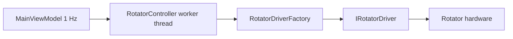

# Building rotator drivers

OscarWatch talks to antenna rotators over a **serial port** (COM on Windows). Each protocol is a small class that implements `IRotatorDriver`. A factory picks the class from user settings.

## Architecture



- **`RotatorController`** ([`OscarWatch/Rotator/RotatorController.cs`](../OscarWatch/Rotator/RotatorController.cs)) — connects, tracks the focused satellite, parks, polls position. Uses [`RotatorAzimuthPlanner`](../OscarWatch.Core/Rotator/RotatorAzimuthPlanner.cs) for smart 450° paths before calling the driver.
- **`IRotatorDriver`** — your implementation (open port, move, query, dispose).
- **`RotatorSettings`** ([`OscarWatch.Core/Models/RotatorSettings.cs`](../OscarWatch.Core/Models/RotatorSettings.cs)) — port, baud rate, type, azimuth/elevation limits, park position.

The controller calls **`SetPosition(commandAz, el, settings)`** with azimuth already planned (0–450 when smart mode is on). The driver only **clamps** to `settings.MaxAzimuthDeg` / `MaxElevationDeg` and formats the wire protocol.

## `IRotatorDriver` contract

```csharp
public interface IRotatorDriver : IDisposable
{
    void Open();
    void SetPosition(double azimuthDeg, double elevationDeg, RotatorSettings settings);
    void Stop();
    (int? Azimuth, int? Elevation) GetPosition();
}
```

| Method | Expectations |
|--------|----------------|
| `Open` | Open the serial port configured in the constructor. Throw or log on failure; controller will tear down and retry later. |
| `SetPosition` | Send a move command. Use `RotatorSettings` limits for clamping. Called ~1 Hz when tracking; skip heavy work if the controller already dedupes (≥1° change). |
| `Stop` | Optional protocol stop (GS-232 `S`). No-op is fine if the protocol has no stop. |
| `GetPosition` | Poll hardware az/el for the sidebar. Return `(null, null)` on timeout or parse failure. |
| `Dispose` | Close the port; call `Stop` if appropriate. |

Reference implementations:

| Driver | Protocol | File |
|--------|----------|------|
| Yaesu GS-232 / clones | `Waaa eee`, queries `C2`/`C`/`B` | [`Gs232Rotator.cs`](../OscarWatch/Rotator/Gs232Rotator.cs) |
| EasyComm II | `AZxxx.x ELxx.x` | [`EasyCommRotator.cs`](../OscarWatch/Rotator/EasyCommRotator.cs) |

## Serial I/O patterns

Existing drivers use **`System.IO.Ports.SerialPort`** with:

- 8N1, no handshake (unless your hardware needs RTS/CTS)
- Line terminator `\r`
- **`SemaphoreSlim(1,1)`** so `SetPosition` and `GetPosition` do not interleave on the same port
- Short sleeps after writes (GS-232 ~150 ms) so the controller can finish before the next command
- `DiscardInBuffer()` before queries to avoid stale data

GS-232 position parsing is in [`Gs232PositionParser`](../OscarWatch/Rotator/Gs232PositionParser.cs) (unit tests in `Gs232PositionParserTests.cs`).

## Step-by-step: add a new rotator type

### 1. Add an enum value

[`OscarWatch.Core/Models/RotatorType.cs`](../OscarWatch.Core/Models/RotatorType.cs):

```csharp
public enum RotatorType
{
    YaesuGs232,
    EasyComm,
    MyProtocol   // new
}
```

### 2. Implement the driver

Create `OscarWatch/Rotator/MyProtocolRotator.cs` implementing `IRotatorDriver`. Keep protocol bytes/strings in this class; do not put serial code in Core.

### 3. Register in the factory

[`OscarWatch/Rotator/RotatorDriverFactory.cs`](../OscarWatch/Rotator/RotatorDriverFactory.cs):

```csharp
public static IRotatorDriver Create(RotatorSettings settings) =>
    settings.Type switch
    {
        RotatorType.EasyComm => new EasyCommRotator(settings.Port, settings.BaudRate),
        RotatorType.MyProtocol => new MyProtocolRotator(settings.Port, settings.BaudRate),
        _ => new Gs232Rotator(settings.Port, settings.BaudRate)
    };
```

### 4. Expose in Settings UI

[`OscarWatch/ViewModels/SettingsViewModel.cs`](../OscarWatch/ViewModels/SettingsViewModel.cs) — add to `RotatorTypeChoices`:

```csharp
new(RotatorType.MyProtocol, "My rotator label")
```

[`OscarWatch/Views/SettingsWindow.axaml`](../OscarWatch/Views/SettingsWindow.axaml) — rotator tab already binds to `RotatorTypeChoices`; no change unless you need extra fields.

`RotatorSettings` is serialized to `%AppData%/OscarWatch/settings.json` automatically when you add properties to the model and map them in `SettingsViewModel` save/load.

### 5. Test without hardware

Use a test double implementing `IRotatorDriver` (see [`RecordingRotatorDriver.cs`](../OscarWatch.Tests/RecordingRotatorDriver.cs)) and inject it into the controller:

```csharp
var rotator = new RecordingRotatorDriver();
var controller = new RotatorController(_ => rotator);
controller.UpdateSynchronously(settings, target);
Assert.Equal(expectedAz, rotator.LastAzimuthDeg);
```

`RotatorController` exposes `UpdateSynchronously` and `DrainCommandQueueForTests` (internals visible to `OscarWatch.Tests`).

Add protocol-specific tests for parsing (pure functions) in `OscarWatch.Tests/`.

### 6. COM port conflict

Rig and rotator cannot share the same COM port. [`SerialPortConflictHelper`](../OscarWatch.Core/Hardware/SerialPortConflictHelper.cs) warns in Settings when both are enabled on one port.

## Smart azimuth (450° rotators)

Drivers do **not** implement shortest-path logic. [`RotatorAzimuthPlanner`](../OscarWatch.Core/Rotator/RotatorAzimuthPlanner.cs) maps compass azimuth to command azimuth (including 361–450°). Your driver must accept commanded values up to `settings.MaxAzimuthDeg` and format them correctly (GS-232 uses three-digit azimuth, e.g. `W370 045`).

## Checklist

- [ ] `IRotatorDriver` implemented with thread-safe serial access
- [ ] `RotatorType` enum + `RotatorDriverFactory` case
- [ ] Settings combo label in `SettingsViewModel`
- [ ] Clamp az/el in `SetPosition` using `RotatorSettings`
- [ ] `GetPosition` returns integers (degrees) or null
- [ ] `Dispose` closes port cleanly
- [ ] Unit tests (parser + `RotatorController` with `RecordingRotatorDriver`)
- [ ] Manual test on real hardware (park, track pass, north wrap if 450°)

## Related files

| File | Role |
|------|------|
| `OscarWatch/Rotator/RotatorController.cs` | Worker thread, track/park/standby |
| `OscarWatch.Core/Services/IRotatorController.cs` | Public API for UI |
| `OscarWatch/Rotator/SerialPortDiscovery.cs` | COM port list for Settings |
